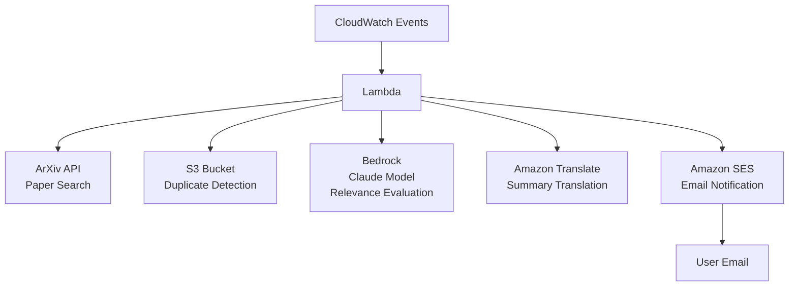

# notify-papers

This is an AWS-based system that automatically collects, evaluates, and notifies about the latest research papers related to specific research topics. Currently it only supports ArXiv as the paper source.

## Architecture



## Deployment

### Prerequisites

Before deploying this system, ensure you have the following tools installed:

- [uv](https://docs.astral.sh/uv/)
- [Terraform](https://www.terraform.io/)
- [AWS CLI](https://aws.amazon.com/cli/)

Also, ensure you have the following prerequisites:

- Enable Claude models in Amazon Bedrock before deployment. Please go to your [Amazon Bedrock Console](https://console.aws.amazon.com/bedrock/) and enable access to Claude models. The default model used is `anthropic.claude-3-haiku-20240307-v1:0`.
- Copy the example configuration file and customize it:
  ```bash
  cp terraform/terraform.tfvars.example terraform/terraform.tfvars
  ```

### Deployment procedure

1. Build lambda package:
   ```bash
   sh scripts/build_lambda.sh
   ```
2. Deploy infrastructure to AWS:
   ```bash
   cd terraform
   terraform init
   terraform apply
   ```

### Postrequisites

After deployment, you'll need to verify your email address. Check your email inbox for a verification email from AWS SES.

## Local Development

### Prerequisites

Before trying this system, ensure you have the following tools installed:

- [uv](https://docs.astral.sh/uv/)
- [Docker](https://www.docker.com/)

Also, ensure you have the following prerequisites:

- Enable Claude models in Amazon Bedrock before deployment. Please go to your [Amazon Bedrock Console](https://console.aws.amazon.com/bedrock/) and enable access to Claude models. The default model used is `anthropic.claude-3-haiku-20240307-v1:0`.

### Run API Locally

1. Set up virtual environment:
   ```bash
   uv sync --frozen
   ```
2. Start mock services:
   ```bash
   docker compose up -d
   ```
3. Set up environment variables (copy and modify as needed):
   ```bash
   cp .env.example .env
   # Edit .env file with your settings, then run:
   set -a && source .env && set +a
   ```
4. Run the function locally:
   ```bash
   uv run python -m src.report_papers.main --end-date 2025-08-01
   ```
5. Check sent emails (SES Mock Web UI):
   ```bash
   open http://localhost:8005
   ```
